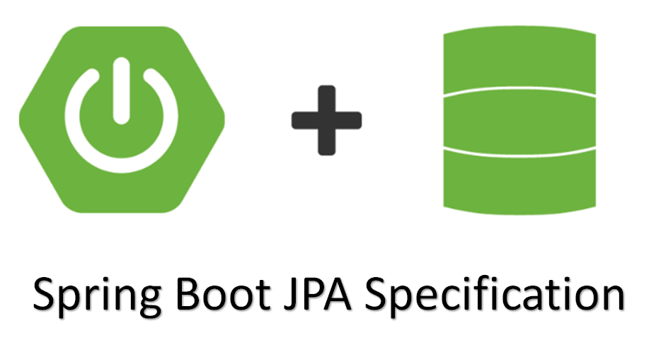
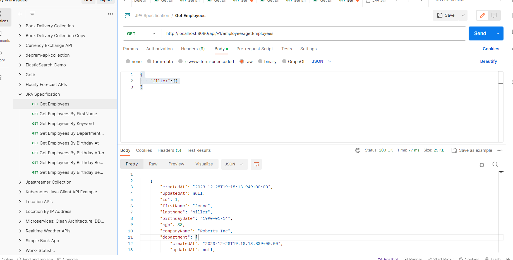
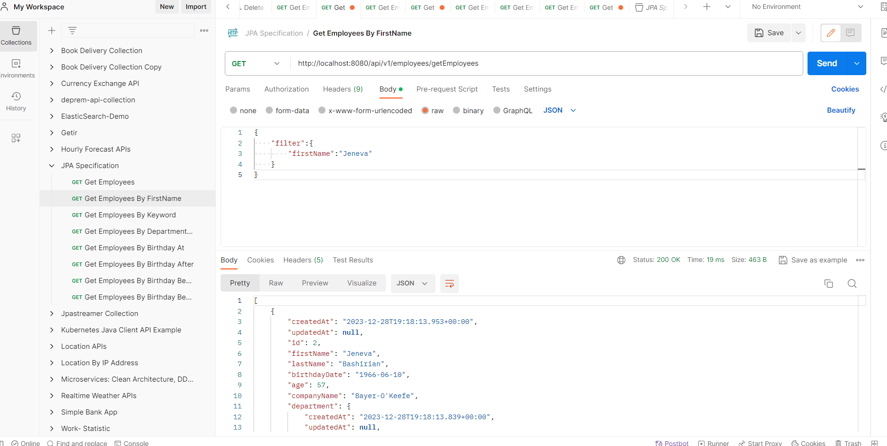
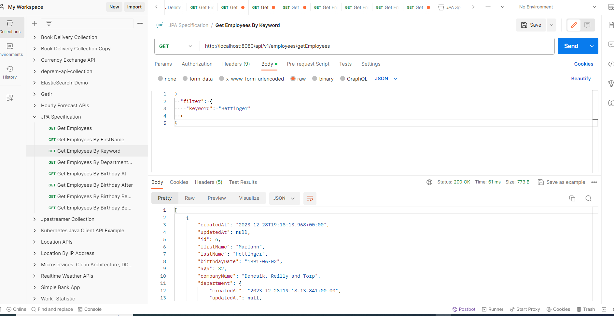
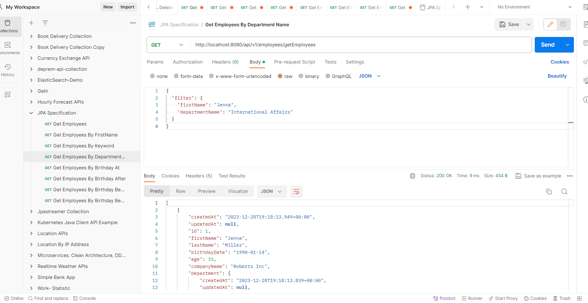
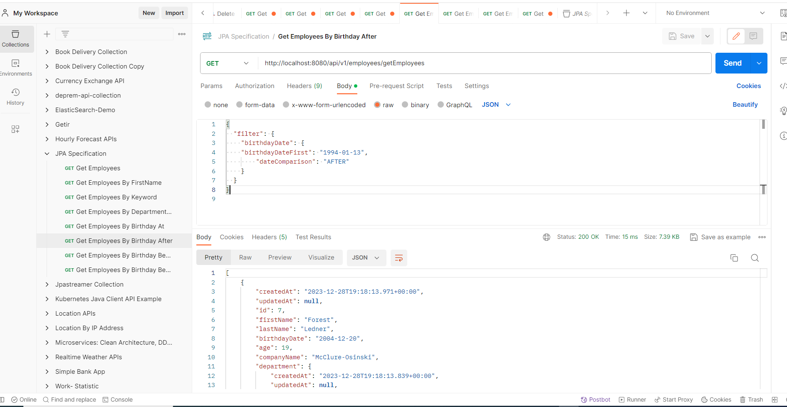
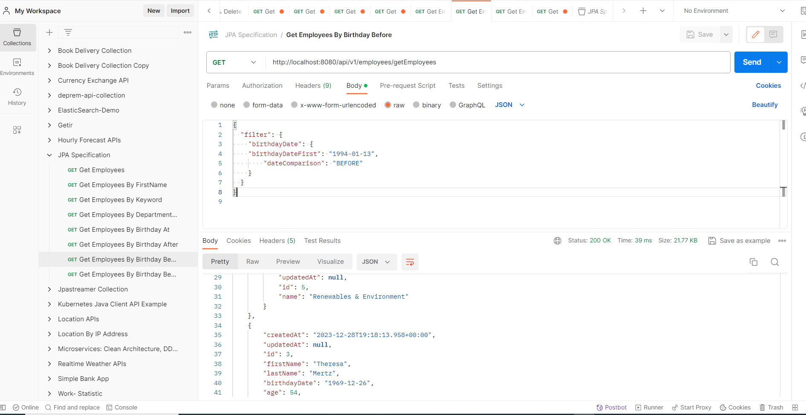
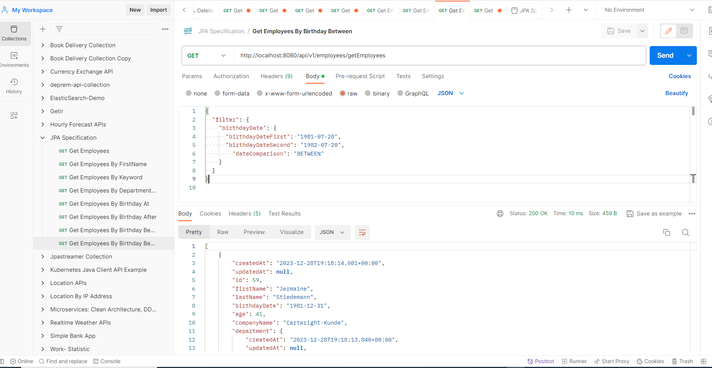

# Spring Boot JPA Specification Example

<p align="center">
    
</p>

### 📖 Information

<ul style="list-style-type:disc">
  <li>This <b>Spring Boot</b> application showcases the integration of the <b>Kubernetes Java Client API</b> to manage Kubernetes resources efficiently.</li> 
  <li>The implemented features cover the processes of <b>listing</b>, <b>creating</b>, <b>editing</b>, and <b>deleting</b> the following <b>Kubernetes</b> resources:</li>
  <ul>
    <li>Namespace</li>
    <li>Pod</li>
    <li>Service</li>
    <li>Deployment</li>
  </ul>
</ul>

### Explore Rest APIs

<table style="width:100%">
  <tr>
      <th>Method</th>
      <th>Url</th>
      <th>Description</th>
      <th>Request Body</th>
      <td></td>
  </tr>
  <tr>
      <td>GET</td>
      <td>/api/v1/employees/getEmployees</td>
      <td>Get Employees</td>
      <td>ListEmployeeRequest</td>
      <td><a href="README.md#getAllEmployees">Info</a></td>
  <tr>
  <tr>
      <td>GET</td>
      <td>/api/v1/employees/getEmployees</td>
      <td>Get Employees By FirstName</td>
      <td>ListEmployeeRequest</td>
      <td><a href="README.md#getEmployeesByFirstName">Info</a></td>
  <tr>
  <tr>
      <td>GET</td>
      <td>/api/v1/employees/getEmployees</td>
      <td>Get Employees By Keyword</td>
      <td>ListEmployeeRequest</td>
      <td><a href="README.md#getEmployeesByKeyword">Info</a></td>
  <tr>
  <tr>
      <td>GET</td>
      <td>/api/v1/employees/getEmployees</td>
      <td>Get Employees By Department Name</td>
      <td>ListEmployeeRequest</td>
      <td><a href="README.md#getEmployeesByDepartmentName">Info</a></td>
  <tr>
  <tr>
      <td>GET</td>
      <td>/api/v1/employees/getEmployees</td>
      <td>Get Employees By Birthday At</td>
      <td>ListEmployeeRequest</td>
      <td><a href="README.md#getEmployeesByBirthdayAt">Info</a></td>
  <tr>
  <tr>
      <td>GET</td>
      <td>/api/v1/employees/getEmployees</td>
      <td>Get Employees By Birthday After</td>
      <td>ListEmployeeRequest</td>
      <td><a href="README.md#getEmployeesByBirthdayAfter">Info</a></td>
  <tr>
  <tr>
      <td>GET</td>
      <td>/api/v1/employees/getEmployees</td>
      <td>Get Employees By Birthday Before</td>
      <td>ListEmployeeRequest</td>
      <td><a href="README.md#getEmployeesByBirthdayBefore">Info</a></td>
  <tr>
  <tr>
      <td>GET</td>
      <td>/api/v1/employees/getEmployees</td>
      <td>Get Employees By Birthday Between</td>
      <td>ListEmployeeRequest</td>
      <td><a href="README.md#getEmployeesByBirthdayBetween">Info</a></td>
  <tr>
</table>

### Request with Request Body

##### <a id="getAllEmployees"> Get Employees
```
    http://localhost:8080/api/v1/employees/getEmployees
    
    {
        "filter":{}
    }
    
```

##### <a id="getEmployeesByFirstName"> Get Employees By FirstName
```
    http://localhost:8080/api/v1/employees/getEmployees
    
    {
        "filter":{
            "firstName":"Stormy"
        }
    }
    
```

##### <a id="getEmployeesByKeyword"> Get Employees By Keyword
```
    http://localhost:8080/api/v1/employees/getEmployees
    
    {
        "filter": {
            "keyword": "Mitchell"
        }
    }
    
```

##### <a id="getEmployeesByDepartmentName"> Get Employees By Department Name
```
    http://localhost:8080/api/v1/employees/getEmployees
    
    {
        "filter": {
            "firstName": "Domonique",
            "departmentName": "Public Safety"
        }
    }
    
```

##### <a id="getEmployeesByBirthdayAt"> Get Employees By Birthday At
```
    http://localhost:8080/api/v1/employees/getEmployees
    
    {
        "filter": {
            "birthdayDate": {
            "birthdayDateFirst": "1984-10-04",
                "dateComparison": "AT"
            }
        }
    }

    
```

##### <a id="getEmployeesByBirthdayAfter"> Get Employees By Birthday After
```
    http://localhost:8080/api/v1/employees/getEmployees
    
    {
        "filter": {
            "birthdayDate": {
            "birthdayDateFirst": "1994-01-13",
                "dateComparison": "AFTER"
            }
        }
    }

    
```

##### <a id="getEmployeesByBirthdayBefore"> Get Employees By Birthday Before
```
    http://localhost:8080/api/v1/employees/getEmployees
    
    {
        "filter": {
            "birthdayDate": {
            "birthdayDateFirst": "1994-01-13",
                "dateComparison": "BEFORE"
            }
        }
    }

    
```

##### <a id="getEmployeesByBirthdayBetween"> Get Employees By Birthday Between
```
    http://localhost:8080/api/v1/employees/getEmployees
    
    {
        "filter": {
            "birthdayDate": {
              "birthdayDateFirst": "1981-07-28",
              "birthdayDateSecond": "1982-07-20",
                "dateComparison": "BETWEEN"
            }
        }
    }

    
```


### Technologies

---
- Java 17
- Spring Boot 3.0
- Restful API
- Lombok
- Maven
- Postman
- Faker
- Spring Boot Devtools

### Maven Run
To build and run the application with `Maven`, please follow the directions shown below;

```sh
$ cd jpaspecification
$ mvn clean install
$ mvn spring-boot:run
```

### Screenshots

### Screenshots

<details>
<summary>Click here to show the screenshots of project</summary>
    <p> Figure 1 </p>
    
    <p> Figure 2 </p>
    
    <p> Figure 3 </p>
    
    <p> Figure 4 </p>
    
    <p> Figure 5 </p>
    
    <p> Figure 6 </p>
    
    <p> Figure 7 </p>
    
    <p> Figure 8 </p>
    
</details>

### Contributors

- [Sercan Noyan Germiyanoğlu](https://github.com/Rapter1990)